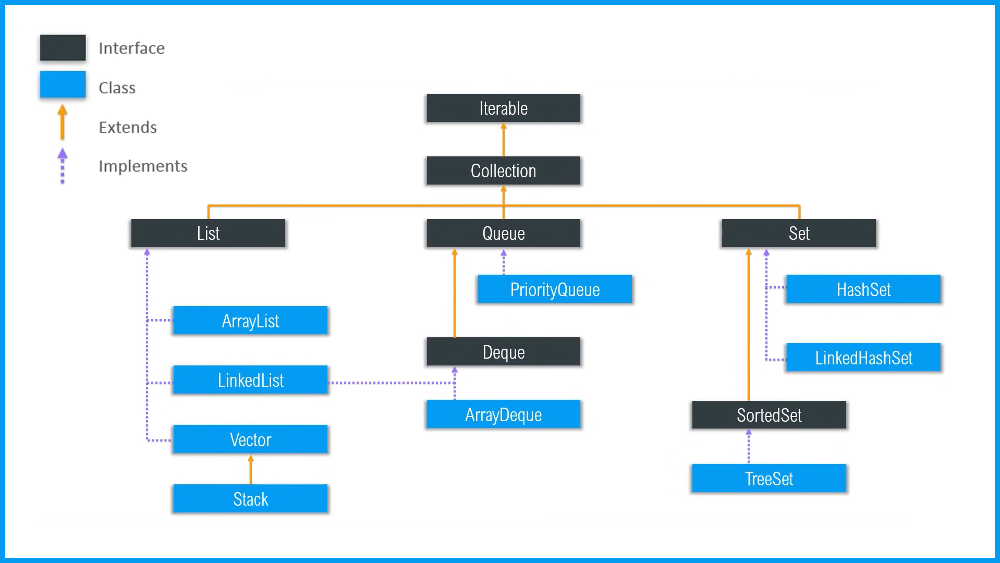
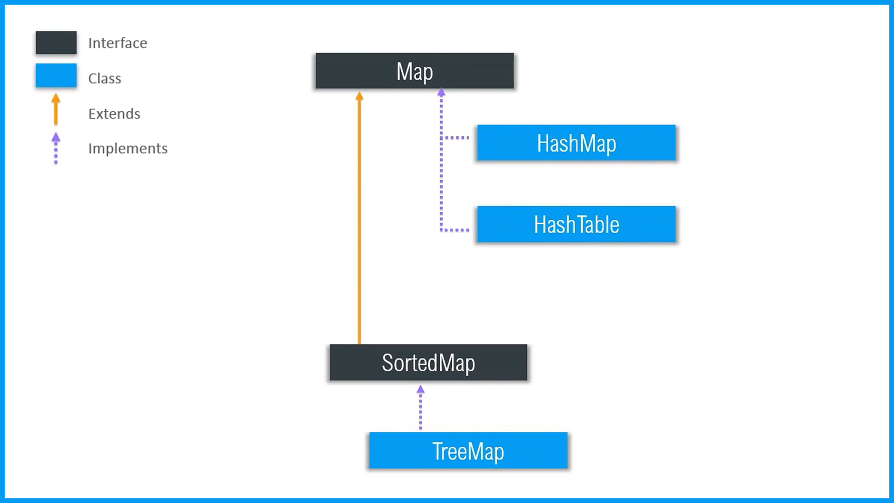

# Java Collections

Java Collections is a Framework that contains a group of classes and interfaces that provides
a "Collection" of standarized data structures whit the main characteristic
that all of them implements a set of common methods and rules. Java Collection
as Framework was first introduced in the JDK 1.2.

Before this concept, collectionswhere a few data structures clases. 
Mainly, were via the array, the Vector, and the Hashtable classes, 
which unfortunately were not easy to extend, and did not implement a 
standard member interface.

Now a days, the Java Collections Framework provides high-performance 
data structures that are easy to use and extend. About this topic,
developers can use the concept of Parameterized Types (or Generics)
to define the type of the elements of the collection.

# Java Interface vs Java Class
In simple terms, an interface is a contract that defines the behavior that a class must implement.
An interface is a blueprint for a class and it is used to achieve abstraction. This means
that in order to ensure this behavior, the class must implement all the methods defined in the interface.

## Here are some key points:

- Class can instantiate variable and create objects, interfaces cannot.
- Class can contain concrete methods, Interfaces contains only abstract methods. 
- Access modifiers are not allowed in interfaces. Only one public specifier is allowed.
- An Interface can implement several interfaces, Classes can only extend other Classes.
- An Interface can exted serveral interfaces.
- Interfaces cannot define Fields (only static ones are allowed), Classes can.
- An Interface cannot be instantiated, a Class can.
- A Class that implements an Interface must implement all the methods defined in the Interface.

# The Iterable Interface
This interface is very important to use, actually all the collections implements this interface.
because of the fact that all data structures must be iterable. In other words, all data structure
that we use must have a way to access all its elements. And tha is what the Iterable interface
ensures.

## Iterable Interface Definition

```java
public interface Iterable<T>
{
  //Returns an iterator over elements of type T
  Iterator<T>    iterator();
  
  //Creates a Spliterator over the elements described by this Iterable
  Spliterator<T> spliterator();

  //Performs a given action for each element
  void           forEach(Consumer<? super T> action);
}
``` 


# Data Structures
The collection framework provides a set of data structures that almost
all developers will use. Bases on the idea that a Data Structure is a
container that holds a set of elements. The collection framework provides
these sets of data structures:

- ArrayList
- LinkedList
- Vector
- Hashtable
- Stack
- Queue
- HashSet
- TreeSet
- HashMap
- TreeMap
- PriorityQueue
- LinkedHashMap
- LinkedHashSet

This is a wide range of data structures that can be used ensuring the best performance possible.
In figures 1 and 2, we can see the Implements and Extends relationships between the data structures.


# Collection Hierarchy
 
*Fig. 1. Collection Hierarchy*

# Map Hierarchy

*Fig 2. Map Hierarchy*

# Features
- Reduces Programming Complexity and Effort by using powerful, performed and
  flexible data structures
- Provides a standard interface for the collection classes
- Increases the interoperability of the collections with other Java applications
- Increases program speed and high-quality implementation
- Encorage the use of generics to define the type of the elements of thecollection
- Provides a set of common methods and rules
- Encourage software reuse
- Garantees uniformity among the framework and reduces the effor of learnig new APIs per structure


# When is it Recommended to Use
The Collection interface (java.util.Collection) and Map interface (java.util.Map) are the two main “root” interfaces of Java collection classes
this means that its implementation is almost by default, they are widely used and i would dare to say that it should be used in almost every situation.
However, there are some situations where low level programming is required in order to get the best performance, like the case of embedded applications
running very close to hardware where the performance is critical and the only data structure used is the array, in this case the framework is not
suportred by the limitations of the hardware.


# References:

| Topic                         | Source                                                            |
| :---------------------------- | :---------------------------------------------------------------- |
| Iterable Interface in Java    | https://www.geeksforgeeks.org/iterable-interface-in-java/         |
| Iterable Definition           | https://docs.oracle.com/javase/8/docs/api/java/lang/Iterable.html |
| Java Collection Core Concepts | https://www.youtube.com/watch?v=Ma7u6KEKzPE&t=1784s               |